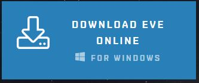
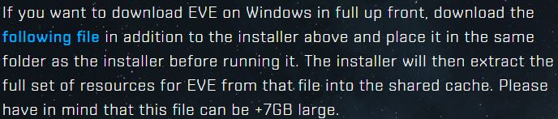
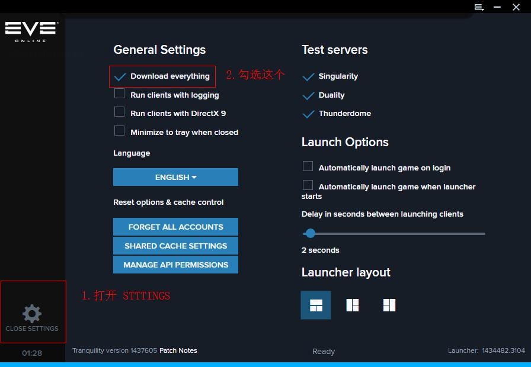
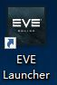
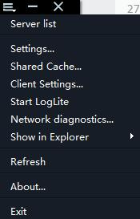

# 游戏安装

### 1.打开下载游戏页面

 [https://www.eveonline.com/download](https://www.eveonline.com/download)

### 2.点击下载

## 3.下载数据

1. 方法一是 一次性下载好数据包，然后离线安装
2. 方法二是 安装好客户端，由客户端自动在线下载更新数据

两种下载数据的方法任选一种即可，自行机智

### 3.1 方法一 第一步 下载数据包

点击 **following file** 下载完整的游戏 **数据包**，建议使用支持多线程下载的下载软件

### 3.2 方法一 第二步 下载完毕

下载好之后把 **数据包** 和 **客户端安装包**放在同一个文件夹，然后打开**安装包**，接着一路下一步吧，安装界面应该是中文的。

途中选择 Resources路径，指的是游戏缓存数据的存储路径，安装过程大概需要10分钟到20分钟。

### 4.1 方法二 客户端自动更新数据

安装好客户端之后让客户端自动在线更新，网速不同速度差异很大，一般都是睡觉前挂着，睡醒了就下完了 :\)

然后点击 **CLOSE SETTINGS** ,接着等待下载完成（下面的进度条会动的），如果你在下载缓存的过程中断开了网络或者关机，重新启动客户端即可，客户端会继续下载，下载的同时你可以注册一个账号了。


不管是使用方法一还是方法二，启动客户端后都要勾选 **Download everything**


## 5. 安装完毕 打开游戏

 

### 到此，EVE安装成功，撒花❀

### ６.客户端菜单

* Server list 服务器列表，世界服一共四个服务器
  * Tranquility 宁静，玩家的游戏服
  * Singularly 奇点，开发工程师的专用服务器
  * Duality 二元，也是开发用的服务器
  * Thunderdome 常说的测试服就是这个，老玩家可进入测试服
* settings 设置
* Shared Cache 共享缓存，就是游戏缓存了
  * 点进去的Verify就是用来验证缓存文件有没有损坏的
  * 某些情况下登陆游戏出现问题就是缓存文件出现损坏
* Network diagnostics 网络诊断 测试网络延时的
* 其他一般没什么用

